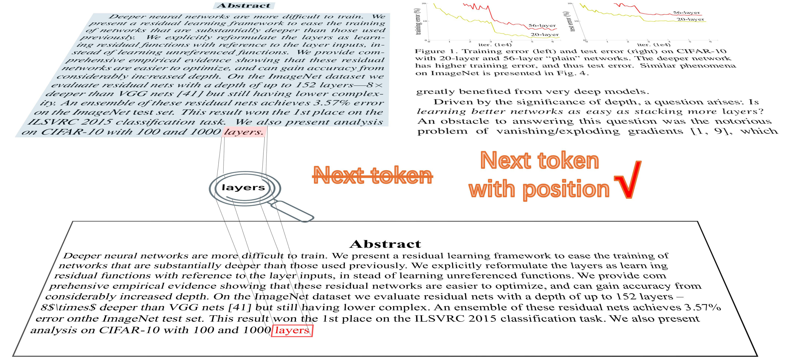

# Lougat

This project aims to create a text scanner that converts paper images into machine-readable formats (e.g., Markdown, JSON). It is the son of Nougat, and thus, grandson of Douat.

The key idea is to combine the bounding box modality with text, achieving a pixel scan behavior that predicts not only the next token but also the next position.



The name "Lougat" is a combination of LLama and Nougat. In this repo, you'll also find other combinations like:

- Florence2 + LLama → Flougat
- Sam2 + LLama → Slougat
- Nougat + Relative Position Embedding LLama → Rlougat

The key idea is nature continues of this paper [LOCR: Location-Guided Transformer for Optical Character Recognition]([[2403.02127\] LOCR: Location-Guided Transformer for Optical Character Recognition (arxiv.org)](https://arxiv.org/abs/2403.02127))

## Dataset

The dataset is the [UltexB](https://huggingface.co/datasets/LLM4SCIENCE/uparxive_boxed_pdf/tree/main) dataset from [Uparxive](https://github.com/veya2ztn/uparxive/blob/release/documents/the_uparxive_text_level_boxed_dataset.md)

### Inference

The model is huggingface compatible. You can 

### Train

```
DATASETTYPE=lougat
MODELTYPE=slougat_small 
trial_name=new_train
python train_via_accelerate.py --task train --model $MODELTYPE--Dataset $DATASETTYPE --root_name "" \
    --preload_weight pretrain_weights/slougat.matched_start.pt \
    --batch_size 10 --gradient_accumulation_steps 5 --lr 0.0001 --num_workers 8 \
    --coordinate_retreive_method mapping_coordinate_hard --trial_name $\
    --start_count 2 --start_weight 2 --token_weight 5 --bbox_weight 1 --find_unused_parameters \
    --epochs 200 --clip_value 1 --use_wandb
```
